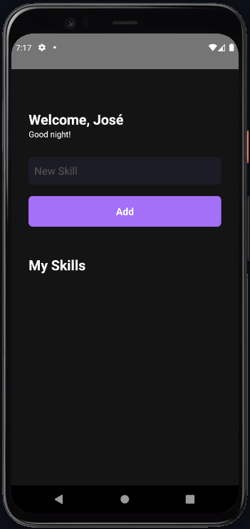
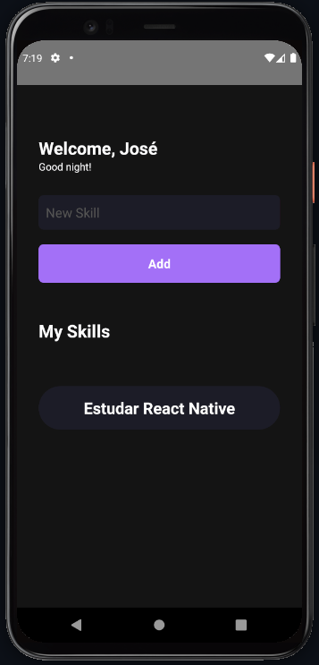

<div align="center">
  <h1>MySkills</h1>
</div>

<div align="center">
<table>
  <tr>
    <th width="45%"></th>
    <th width="45%"></th>
  </tr>
</table>
</div>
<br>

## 💻 Projeto

Aplicativo desenvolvido no capítulo 1 do bootcamp Ignite da Rocketseat, mais especificamente na trilha de React Native.

## ✨ Tecnologias

- [ ] React Native

## :hammer_and_wrench: Features

- [ ] Criação de listagem de habilidades

## Executando o projeto

Utilize o **yarn** ou o **npm install** para instalar as dependências do projeto.
Em seguida, inicie o projeto utilizando dois terminais, no primeiro execute:

```cl
yarn start
```

No segundo execute:

```cl
yarn android
```

**&copy; [Rocketseat](https://rocketseat.com.br/)**

**Instrutor: [Rodrigo Gonçalves Santana](https://github.com/rodrigorgtic) | Instructor & Content Producer at Rocketseat**

---

<h4 align="center">by <a href="https://github.com/JoseAAAM" target="_blank">JoseAAAM</a> </h4>
